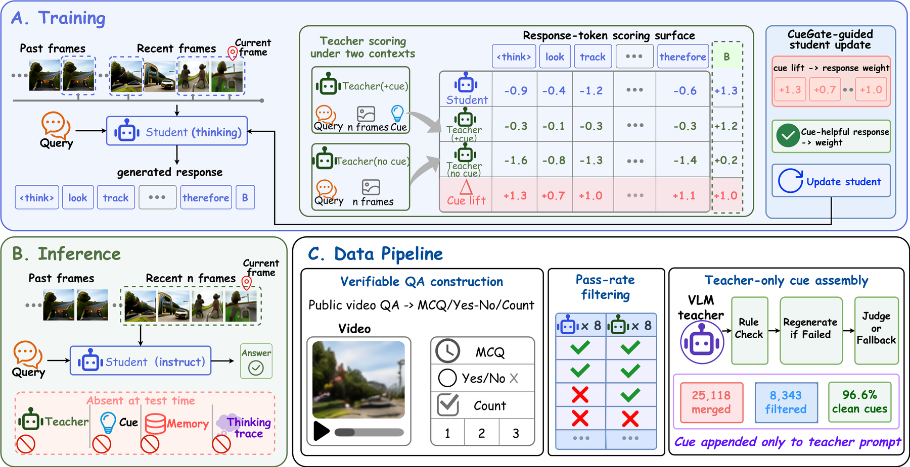
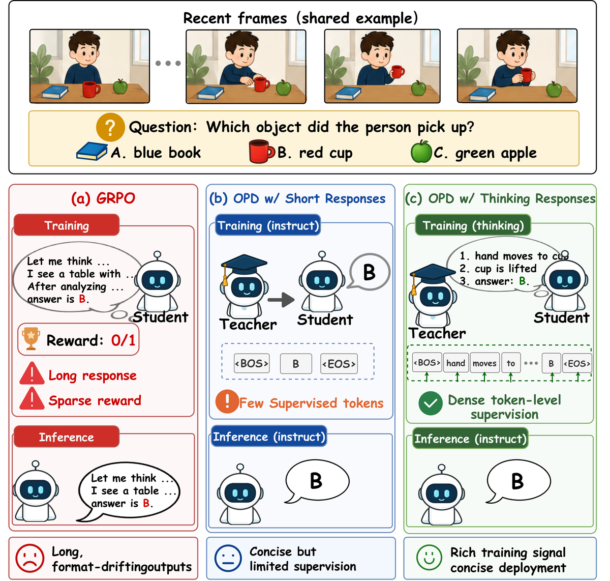
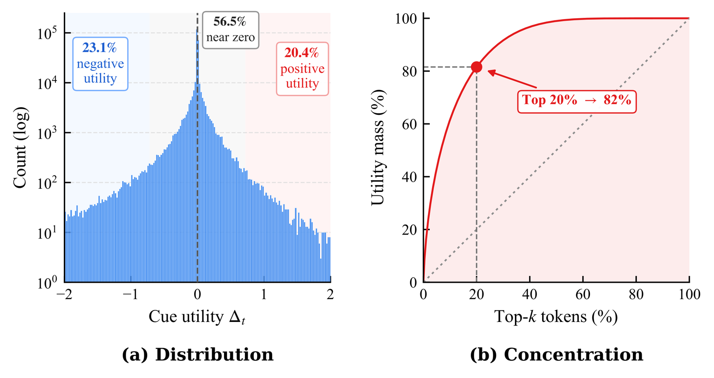

<div align="center">

# StreamOPD

**A Post-Training Recipe with Spatio-Temporal Cue Gating for Streaming Video Understanding**

<!-- Once the preprint is live, drop the arXiv and Daily Paper badges in here:
[](https://arxiv.org/abs/XXXX.XXXXX)
[](https://huggingface.co/papers/XXXX.XXXXX)
-->

[](https://unix-ai-lab.github.io/StreamOPD/)
[](https://github.com/UniX-AI-Lab/StreamOPD)
[](https://huggingface.co/UniX-Lab/StreamOPD-4B-ST-CueGate)
[](LICENSE)

[Install](docs/INSTALL.md) · [Data](docs/DATA.md) · [Training](docs/TRAINING.md) · [Evaluation](docs/EVALUATION.md) · [Method](docs/METHOD.md)

</div>

Streaming video understanding requires answering from the causally observed prefix of a
video that is still unfolding. Most systems attack this with memory banks, retrieval, or
KV-cache compression — yet a training-free recent-window baseline already matches them. We
take that as a hint and fix the inference path entirely: **four recent frames at 1 fps, no
memory, no retrieval, no compression, no reasoning trace at test time.** With the
architecture and inference cost held constant, any gain has to come from the weights.

Under that constraint a 4B student reaches **84.6% on StreamingBench** and **69.3 OVO-Bench
macro**, passing its own 9B teacher on both, and beating HERMES-7B — the strongest streaming
system we compare against — by 5.1 and 10.1 points while using a strictly memory-free
four-frame context.



## Two parts

**StreamOPD (the recipe).** A 25k verifiable video-QA pipeline, on-policy distillation with
teacher and student both in *thinking* mode, and deployment in *instruct* mode. The training
mode matters more than it looks: of the teacher/student mode pairings we tried, only
both-thinking converges, while both-instruct and teacher-thinking/student-instruct collapse
early. Pure RL is the wrong tool here — teacher-free GRPO keeps its reward high while
drifting to long rationales that break the deployed direct-answer format.



Training in thinking mode is what supplies enough supervised token positions for the dense
teacher signal to be stable; instruct-mode deployment then keeps the answer concise and in
the format the benchmarks expect.

**ST-CueGate (the extension).** Once the recipe is fixed, the remaining question is not how
big the teacher is but *what it is shown*. Giving the teacher a grounded spatio-temporal cue
helps unevenly, and the unevenness is extreme:



Across 300,866 response tokens, 56.5% of cue-versus-no-cue contrasts are essentially zero
and 23.1% are negative, while the top 20% of positive tokens carry 82% of the positive mass.
Supplying the cue uniformly therefore spends most of the supervision where the cue did
nothing. ST-CueGate scores the *same* student response under two nested teacher contexts —
with the cue and without it — and uses the contrast to reweight distillation:

```
Δ_t = log π_teacher(y_t | q, c) − log π_teacher(y_t | q)      per-token cue contrast
g   = (1/T) Σ_t Δ_t                                            response-level proxy
w   = clip(1 + α_g · z(g), 0, 2)                               group-relative gate
A_t = w · ( τ_t⁺ − s_t )                                       gated OPD advantage
```

The gate is deliberately *relative*: `z(·)` standardises within a comparison group (the
minibatch at n=1, sibling rollouts at n>1), so a response is up-weighted for being more
cue-sensitive than its peers, not for clearing an absolute bar. Setting `α_g = 0` gives
`w ≡ 1` and exactly recovers passive cue conditioning, which makes the ablation clean. The
no-cue pass reuses the student's decoded frames and the same teacher pool, so it costs no
extra GPUs and touches training only through `w`.

## Results

Streaming benchmarks, instruct mode, recent-4-frame window. Each configuration is trained
with three seeds; one model per run is selected on a held-out validation aggregate and
evaluated on all benchmarks, and entries are means over the three runs.

| Model | Frames | StreamingBench | OVO Real-Time | OVO Backward | OVO Macro |
|-------|:---:|:---:|:---:|:---:|:---:|
| *Human* | — | *91.46* | *93.2* | *92.3* | *92.77* |
| Dispider-7B | 1 fps | 67.63 | 54.6 | 36.1 | 45.35 |
| TimeChat-Online-7B | 1 fps | 75.28 | 61.9 | 41.7 | 51.80 |
| StreamForest-7B | 1 fps | 77.26 | 61.2 | 52.0 | 56.60 |
| HERMES-7B | 1 fps | 79.44 | 69.0 | 49.4 | 59.20 |
| Qwen3.5-9B *(teacher)* | 4 | 84.15 | 82.0 | 53.9 | 67.95 |
| Qwen3.5-4B *(student)* | 4 | 77.87 | 70.6 | 48.8 | 59.71 |
| &nbsp;&nbsp;+ OPD | 4 | 83.91 | 80.5 | 51.2 | 65.89 |
| &nbsp;&nbsp;+ **ST-CueGate** (OPD) | 4 | **84.55** | **82.6** | **56.0** | **69.34** |
| &nbsp;&nbsp;+ **ST-CueGate** (OPSD) | 4 | 83.35 | 79.2 | **56.0** | 67.60 |

Teacher conditioning and gating, all on the same 25k pool. OVO excludes HLD here; see
[below](#the-abstention-caveat).

| Method | Grounded | StreamingBench | OVO (excl. HLD) | Video-MME | LongVideoBench | Avg. |
|--------|:---:|:---:|:---:|:---:|:---:|:---:|
| Qwen3.5-4B *(student)* | — | 77.87 | 59.94 | 64.22 | 57.74 | 64.94 |
| OPD (n=1) | — | 83.91 | 69.02 | 63.33 | 59.84 | 69.03 |
| OPD (n=4) | — | 83.83 | 70.09 | 64.07 | 61.26 | 69.81 |
| ExOPD (n=1) | ✗ | 84.29 | 68.38 | 63.78 | 60.36 | 69.20 |
| ViCuR cue-only (n=1) | ✓ | 84.27 | 67.98 | 60.56 | 54.00 | 66.70 |
| ViCuR cue-only (n=4) | ✓ | 84.49 | 67.86 | 64.11 | 60.73 | 69.30 |
| V-Zero (n=4) | ✓ | 83.99 | 67.71 | 61.67 | 60.06 | 68.36 |
| **ST-CueGate** (n=4) | ✓ | **84.55** | **71.93** | **64.85** | **61.41** | **70.69** |

What these say:

- **Distillation closes the 4B→9B streaming gap.** OPD lifts StreamingBench 77.9 → 83.9,
  within 0.3 of the teacher, and OVO excluding HLD by 9.1 points, unevenly across subtasks
  (STU +20.7, OCR +13.4, the rest +3.0 to +9.2). Teacher-free GRPO does not: it scores 82.4%
  under the reward's last-letter parser but 35.1% under the deployed first-answer parser,
  with median response length growing more than tenfold. Distilled models stay concise and
  parser-invariant, so the dense signal anchors response *format* as well as content.
- **Gating beats supplying.** ST-CueGate improves on rollout-matched OPD (n=4) across all
  four benchmarks and beats ViCuR cue-only everywhere, so the gain comes from weighting
  cue-conditioned supervision rather than from the cue itself. Swapping the negative view
  for a temporally shuffled video (V-Zero) loses that gain: the reference has to hold frames
  and response fixed and remove *only* the cue.
- **It is the only variant that never trades away general video ability.** Read the table
  against its first row: every other configuration ends up below the untrained student on
  Video-MME. ST-CueGate stays above the base model on all four benchmarks.
- **The student overtakes its teacher.** ST-CueGate exceeds the 9B teacher on six of nine
  OVO subtasks (by 1.1–4.0 points), on the OVO macro (69.34 vs 67.95), and on StreamingBench
  (84.55 vs 84.15) — consistent with on-policy supervision shaping the student along its own
  trajectory distribution rather than transferring a fixed ceiling.
- **A bigger teacher is not a better teacher.** Swapping the 9B for a 27B, reusing the same
  gate and optimizer settings, is worse on all four benchmarks (−1.0 StreamingBench, −7.0
  LongVideoBench). Read as evidence that scale alone does not guarantee better on-policy
  supervision, not as a tuned 27B result.

### The abstention caveat

OVO's HLD subtask scores *refusing* to answer unanswerable queries, which is a different
skill from streaming recall, so we report it separately. Larger-teacher distillation costs
abstention: HLD drops from 47.9 (student) to 38.7 (OPD), recovering to 45.7 with
ST-CueGate. The loss is not intrinsic to the recipe, though. Replacing the 9B teacher with a
frozen copy of the student's own initial policy — on-policy self-distillation — keeps most
of the streaming gains and pushes HLD to **57.0**, above both the untrained student (47.9)
and the 9B teacher (47.3). That variant needs no larger model at all:

```bash
TEACHER_MODEL=Qwen/Qwen3.5-4B bash scripts/train/cuegate.sh    # ST-CueGate (OPSD)
```

### Gate settings

`α_g = 0.5` is best on all four benchmarks; pushing it to 1.0 consistently hurts, so the
likelihood contrast works as a moderate ranking signal rather than an amplified weight.
Response-level gating beats per-token gating (−3.2 OVO, −1.4 LongVideoBench), which is
consistent with individual token contrasts being too noisy to act as independent weights.

## Repository layout

| Path | Contents |
|------|----------|
| `verl/` | Vendored [verl](https://github.com/volcengine/verl) with the distillation additions; see [`verl/PATCHES.md`](verl/PATCHES.md) |
| `streamopd/` | Recent-window streaming inference, StreamingBench / OVO-Bench evaluators, OVO scoring |
| `scripts/train/` | One launcher per row of the tables above |
| `scripts/eval/` | Four-benchmark evaluation and score aggregation |
| `tools/data/` | Format conversion → pass-rate filtering → merge/dedup → cue generation |
| `data/` | Training and validation parquets (annotations only; videos downloaded separately) |

Launchers map to the tables as follows. Everything is environment-overridable, so the
variants differ only in what you set:

| Script | Table row |
|--------|-----------|
| `opd.sh` | OPD (n=1); `ROLLOUT_N=4` for OPD (n=4) |
| `cuegate.sh` | **ST-CueGate**; `TEACHER_MODEL=<4B>` for the OPSD variant |
| `vicur.sh` | ViCuR (cue-only) — identical to ST-CueGate at `α_g = 0` |
| `exopd.sh` | ExOPD |
| `vzero.sh` | V-Zero (shuffled-video negative view) |
| `afd.sh` | Asymmetric frame budget (appendix) |
| `grpo.sh` | Teacher-free GRPO format-drift diagnostic |

## Released checkpoint

The ST-CueGate model is on the Hub as
[`UniX-Lab/StreamOPD-4B-ST-CueGate`](https://huggingface.co/UniX-Lab/StreamOPD-4B-ST-CueGate).
It is already in HuggingFace format, so the evaluators accept the repo id directly and no
training or checkpoint merging is needed to reproduce its scores:

```bash
bash scripts/eval/run_all.sh UniX-Lab/StreamOPD-4B-ST-CueGate streamopd_release 0,1,2,3
bash scripts/eval/score_all.sh streamopd_release
```

| Checkpoint | StreamingBench | OVO (excl. HLD) | Video-MME | LongVideoBench |
|---|:---:|:---:|:---:|:---:|
| `StreamOPD-4B-ST-CueGate` | 84.19 | 70.48 | 64.85 | 60.36 |

## Quick start

```bash
# 1. environment — vLLM and flash-attn are built from source, budget ~50 min
uv venv /path/to/env --python python3.12 && pip install -e ./verl --no-build-isolation

# 2. point the shipped parquets at your local copy of the public videos
python tools/data/retarget_video_root.py --root /your/dataset/root --check-exists

# 3. train (8 GPUs: 4 student + 4 frozen teacher)
bash scripts/train/cuegate.sh

# 4. merge the checkpoint and evaluate on four benchmarks
bash scripts/merge_checkpoint.sh checkpoints/<experiment>/global_step_<N>
bash scripts/eval/run_all.sh checkpoints/<experiment>/global_step_<N>/actor/huggingface my_run 0,1,2,3
bash scripts/eval/score_all.sh my_run
```

Full walkthrough: [Install](docs/INSTALL.md) → [Data](docs/DATA.md) →
[Training](docs/TRAINING.md) → [Evaluation](docs/EVALUATION.md). The method and its negative
results are written up in [Method](docs/METHOD.md).

## Citation

```bibtex
@article{wu2026streamopd,
  title   = {StreamOPD: A Post-Training Recipe with Spatio-Temporal Cue Gating
             for Streaming Video Understanding},
  author  = {Wu, Keming and Wang, Baoyi and Zhang, Kaichen and An, Xiang and
             Yang, Zuhao and Wang, Sudong and Zhu, Haowei and Huang, Tingxuan and
             Gao, Hongcheng and Wang, Bin},
  journal = {arXiv preprint arXiv:XXXX.XXXXX},
  year    = {2026}
}
```

## License

Apache-2.0. This repository vendors [verl](https://github.com/volcengine/verl) (Apache-2.0)
under `verl/`, modified as described in [`verl/PATCHES.md`](verl/PATCHES.md).
