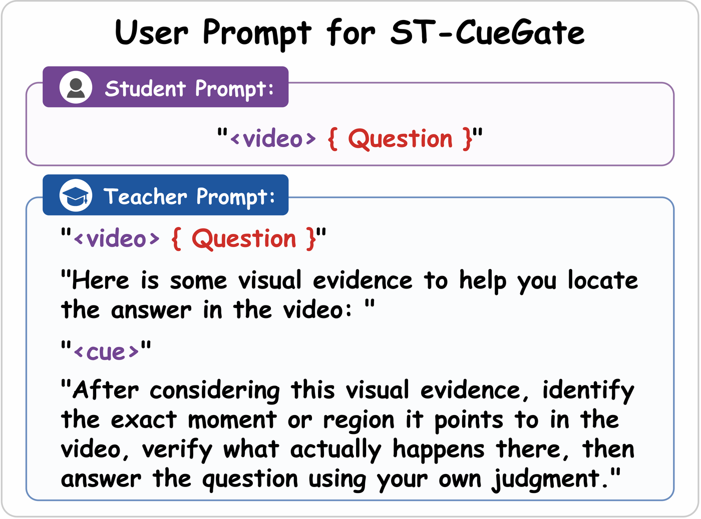

# Method

## The streaming protocol

A streaming model must answer at an arbitrary timestamp from what it has already seen. We
fix the inference protocol rather than designing memory for it: video is decoded at 1 fps
into 1 s chunks, and at answer time the model conditions only on the 4 most recent frames.
No memory bank, no retrieval, no compression, no thinking trace at test time.

Holding that constant removes architecture and inference cost as variables, so any
improvement is attributable to the weights.

## OPD backbone

Let `π_θ` be the student and `π_τ` a frozen teacher. For each prompt the student samples an
on-policy response `y`, and on each valid response token:

```
s_t = log π_θ(y_t | y_<t, q)          student
τ_t = log π_τ(y_t | y_<t, q)          teacher
A_t = τ_t − s_t                       sampled-token k1 reverse-KL advantage
```

`A_t` enters a token-level policy-gradient objective as a stop-gradient advantage, with
clipped importance ratios to the rollout policy. Every variant below changes *only* this
advantage.

Because the teacher only scores text the student produced, the teacher's *input* may differ
from the student's without breaking the objective. That is the primitive the privilege
variants rely on, and it is why teacher log-probabilities are extracted over response tokens
only and aligned to the student's generated tokens: once the teacher is conditioned
differently, the two prompts have different lengths.

The teacher need not be larger. The same formulation supports **on-policy self-distillation
(OPSD)** with a frozen copy of the student's own initial policy under a different
conditioning context.

## Training and deployment modes

The backbone is a unified thinking/instruct model, so the training configuration can be
decoupled from the deployed response mode. Of the tested teacher/student pairings, only
**both-thinking** converges; both-instruct and teacher-thinking/student-instruct collapse
early — validation falls from ~69% to 23-26% within 100 steps, with gradient-norm spikes of
70-120 against 1-10 in the stable run.

The failed runs produce very short responses, which is consistent with sampled-token
reverse-KL updates being supported by fewer token positions and carrying higher effective
variance. That said, this comparison changes mode-specific policy distributions,
teacher-student KL, normalization and clipping all at once, so short trajectories are a
mechanistic *hypothesis*, not an identified cause. What the experiments support is the
pairing itself: **train in thinking mode, deploy in instruct mode.**

## Teacher privilege, and why groundedness matters

If the teacher can be given information the student lacks, which information helps? The
organizing property is **clip-grounded provenance**: whether the teacher's condition is
generated from the same training clip rather than copied from an answer-side oracle. This is
a statement about training-time provenance only — the cue is teacher-only and never
available during inference.

**Ungrounded.** ExOPD extrapolates the teacher's improvement over the frozen base by a
factor λ ≥ 1, `A = −[(s − b) − λ(τ − b)]`, aiming past the teacher's ceiling. It manipulates
the learning signal without conditioning on anything the student could observe, and does not
consistently improve the four benchmarks.

**Grounded but passive.** ViCuR (cue-only) appends a short screened spatio-temporal cue to
the teacher prompt, uniformly for every rollout. It is grounded, and it still does not beat
standard OPD across the board — supplying privilege is not the same as extracting value from
it.

**Grounded and gated: ST-CueGate.** Measure what the cue actually bought, then weight by it.

## ST-CueGate

The frozen teacher scores the same student response under two nested contexts, differing
only in cue presence:

```
τ_t⁺ = log π_τ(y_t | y_<t, q, c)      with cue     ← also the distillation target
τ_t⁻ = log π_τ(y_t | y_<t, q)         without cue  ← reference only
Δ_t  = τ_t⁺ − τ_t⁻                    pointwise conditional log-likelihood ratio
```

`Δ_t > 0` means the cue raised the teacher's confidence in the token the student actually
produced. Teacher, frames, question, prefix and token are all held fixed, so the contrast
isolates the cue.

This contrast is sharply non-uniform. Over 300,866 response tokens, 56.5% are near zero
(|Δ| ≤ 0.01), 23.1% are negative, and the top 20% of positive-score tokens carry 82% of the
total positive mass. Uniform cue conditioning therefore spends most of its supervision where
the cue did nothing, which is the concrete motivation for gating.

Aggregate to a length-normalized response proxy, standardize within a comparison group, and
gate the advantage:

```
g   = (1/T) Σ_t Δ_t  =  (1/T) log [ π_τ(y | q, c) / π_τ(y | q) ]
g̃   = (g − μ_G) / (σ_G + ε)           population statistics over group G
w   = sg[ clip(1 + α_g · g̃, w_min, w_max) ]
A_t = w · (τ_t⁺ − s_t)
```

`G` is the minibatch at n=1 and the sibling rollouts sharing a prompt at n>1; a singleton
group gets the neutral gate `w = 1`. Defaults are `α_g = 0.5` and `[w_min, w_max] = [0, 2]`.

Two properties worth stating plainly:

- **The ranking is relative, not absolute.** If every `g` in a group is negative, a
  less-negative response is still up-weighted.
- **The gate is response-level, not token-level.** Although `Δ_t` is per token, one scalar
  `w` multiplies every token advantage in the response, so ST-CueGate does *not* localize
  which tokens benefited. Averaging also removes first-order scaling with token count but
  stays sensitive to response composition, formatting tokens, and teacher calibration.
  Treat `g` as a relative cue-sensitivity proxy, not faithful utility attribution.

Empirically the response-level choice is the right one: per-token gating loses 3.2 points on
OVO and 1.4 on LongVideoBench, consistent with individual token contrasts being too noisy to
act as independent weights.

Degeneracies are exact, which keeps the ablations clean:

| Setting | Reduces to |
|---------|------------|
| `α_g = 0` | ViCuR cue-only (`w ≡ 1`, identical distillation gradient) |
| singleton comparison group | neutral gate |
| cue rejected during screening | standard OPD (`teacher_prompt == prompt`, so Δ = 0) |
| `λ = 1` in ExOPD | standard OPD |

Cost: one extra teacher forward per sample. It reuses the student's decoded frames and the
same teacher pool, so it adds no GPU allocation and affects training only through `w`.

### Why the reference has to be cue removal

The gating machinery is generic — any positive/negative view pair yields a weight. Replacing
the negative view with a temporally shuffled video (the V-Zero formulation) keeps the
mechanism but loses the gain, scoring below ST-CueGate on every axis. The unifying
requirement is clip-grounded provenance *with a cue-specific reference*: hold the frames and
the realized trajectory fixed and remove only the cue.

## Data and cues

About 25k verifiable video questions in MCQ, binary and counting formats, built from public
instruction data. A stronger frozen VLM reads each complete short clip and emits a
spatio-temporal pointer, with the answer options removed from its input.

Rule-based screening, regeneration and a deterministic judging pass by the same generator
accept ~96.6% of cues; rejected samples fall back to the original teacher prompt. Because
that self-check is correlated with the generator, two annotators also reviewed 300 accepted
cues and flagged 3 direct-answer leaks, 4 indirect semantic leaks, and 6 unsupported or
mis-grounded pointers — a residual leakage rate of 7/300 among accepted cues.

The cue is added only to the teacher prompt, through an explicit instruction block. The
student prompt and inference path are untouched, which is what makes every cue variant a
single-variable comparison.



## Negative results

Recorded because the boundary is the informative part.

- **AD-ExOPD** (separate frame and capacity extrapolation axes, λ_t=1.5, λ_c=1.0)
  oscillated at 50-65% validation for the whole run against ~70% for standard OPD, and hurt
  early convergence. A second ungrounded axis only destabilizes training.
- **DAD**, an ungrounded reweighting control that up-weights responses where student and
  teacher disagree, reaches 84.27 on StreamingBench but only 68.10 OVO (excl. HLD) and 62.93
  Video-MME — no consistent improvement. Observation-agnostic difficulty weighting is not
  the same as grounded privilege.
- **GRPO in instruct mode** diverges early; in thinking mode it plateaus near the untrained
  student.
- **V-Zero** with a shuffled-video negative view underperforms cue removal, as above.
- **AFD v2/v3** (denser teacher frames at fps 4/64 frames; and a strict frame superset)
  plateaued near 60% validation and trailed OPD by ~10 points at matched steps. Letting the
  teacher simply see more frames does not translate into better supervision when that extra
  evidence is unavailable to the student at its own frame budget.
- **A 27B teacher** underperforms the 9B on all four benchmarks when reusing the 9B's gate
  and optimizer settings. Not a tuned upper bound for 27B, but evidence that teacher scale
  alone does not guarantee better on-policy supervision — a closer-capacity teacher may
  produce token distributions better aligned with the student's own trajectories.
